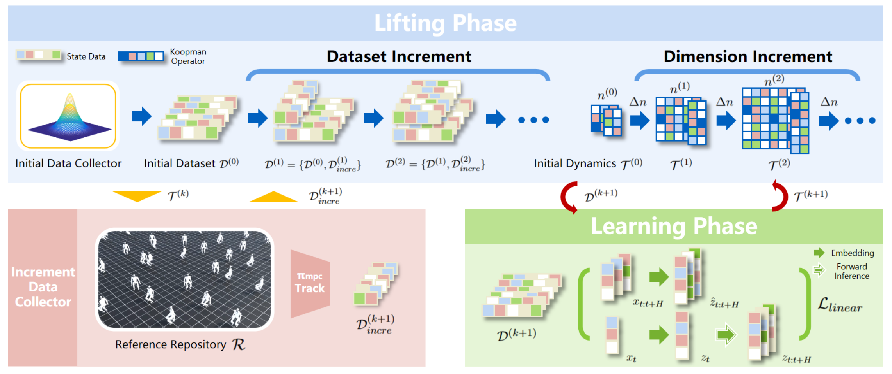

## <div align = "center">Continual Learning and Lifting of Koopman Dynamics for Linear Control of Legged Robots</div>


<div align="center">
<a href="https://arxiv.org/abs/2411.14321v1"></a>
<a href="https://intelligent-control-lab.github.io/Incremental-Koopman/">

</a>
<a href="https://www.youtube.com/watch?v=5tsSdKkTc4M">

</a>
<a ></a>
<a href="https://github.com/intelligent-control-lab/Incremental-Koopman/stargazers">

</a>
<a href="https://github.com/intelligent-control-lab/Incremental-Koopman/network/members">

</a>
<a href="https://github.com/intelligent-control-lab/Incremental-Koopman/issues">

</a>
</div>  

> [Feihan Li](https://scholar.google.com/citations?user=MD7QbZMAAAAJ&hl=en&oi=ao), [Abulikemu Abuduweili](https://scholar.google.com/citations?user=6Oro5g8AAAAJ&hl=en), [Yifan Sun](https://scholar.google.com/citations?user=DGhQSYUAAAAJ&hl=en), [Rui Chen](https://scholar.google.com/citations?user=XiUE0wMAAAAJ&hl=en), [Weiye Zhao](https://scholar.google.com/citations?user=P-79KOcAAAAJ&hl=en) and [Changliu Liu](https://scholar.google.com/citations?user=vvzAfOwAAAAJ&hl=en)
>
> Carnegie Mellon University, Robotics Institute, Intelligent Control Lab.


### News
* **`21 Nov 2024`:** We released our paper on Arxiv and submit it to [L4DC 2025](https://sites.google.com/umich.edu/l4dc2025/).
* **`25 Dec 2024`:** We uploaded the video of our work to [Youtube](https://www.youtube.com/watch?v=5tsSdKkTc4M).
* **`01 Mar 2025`:** Our work were accepted by [L4DC 2025](https://sites.google.com/umich.edu/l4dc2025/)! 
* **`19 Mar 2025`:** We released our code on Github.

## Abstract
<div align = "center"> </div>

### Project Features and Contributions  

- **Incremental Koopman Algorithm**: We propose an **incremental Koopman algorithm** tailored for high-dimensional legged robot dynamics, enabling continual learning and refinement of Koopman linearization.  

- **Continual Learning Mechanism**: By **progressively expanding the training dataset and the latent space dimension**, our method improves the Koopman linearization, effectively reducing approximation errors.  

- **Theoretical Convergence Guarantee**: We provide a **theoretical analysis and guarantee** that the learned Koopman dynamics converge to the true Koopman dynamics.  

- **First Data-Driven Koopman Control for High-Dimensional Legged Robots**: This work is the **first** to implement **data-driven Koopman-based whole-body dynamics linearization** combined with **linear MPC controllers** for locomotion control of high-dimensional legged robots.  

- **Reduced Dependence on Domain Expertise and Improved Generalization**: Compared to traditional Koopman approaches, our method **reduces reliance on expert knowledge** and enhances generalizability across different tasks.  

### Introduction Videos 
[](https://www.youtube.com/watch?v=5tsSdKkTc4M)


## Getting Started

### Installation

- Follow the installation steps of [IsaacLab](https://github.com/isaac-sim/IsaacLab). Make sure to install `rsl_rl` during the installation process. 
- Notice that our code is tested on [IsaacLab v2.0.2](https://github.com/isaac-sim/IsaacLab/releases/tag/v2.0.2).

### Training

- Activate the environment built by IsaacLab.

- Initiate the codes for isaaclab, training RL data collector, build initial dataset and build reference repository.
    ```
    ./init.sh <Path to IsaacLab Root Dir> <Task Type> <Specifide Data Dir>
    ```
    - Here `<Path to IsaacLab Root Dir>` is the location of your IsaacLab Repository, `<Task Type>` is your wanted task type (choices are `unitree_go2_flat`, `unitree_a1_flat`, `anymal_d_flat`, `g1_flat`, `h1_flat`) and `<Specifide Data Dir>` is your specified data saving directory. 
    - Initial dataset will be saved to `<Specifide Data Dir>/<Task Type>/initial_dataset` and reference repository will be saved to `<Specifide Data Dir>/<Task Type>/reference_repository/`
    - RL data collector checkpoints and videos for visualizing the generating process will be saved to `<Path to IsaacLab Root Dir>/logs/rsl_rl/<Task Type>/`

- Build dynamics based on current dataset and generate tracking data with MPC data collector.
    ```
    ./iterate.sh <Path to IsaacLab Root Dir> <Task Type> <Specifide Data Dir>
    ```
    - Trained Koopman Dynamics model will be saved to `Incremental-Koopman/logs/<Task Type>/Iter<Num>_<Running Time>`. Here `Iter<Num>` represents the number of current iteration which actually depends on the files number in `<Specifide Data Dir>/<Task Type>/tracking_dataset/`. 
    - Tracking dataset generated by MPC data generator and current Koopman Dynamics will be saved to `<Specifide Data Dir>/<Task Type>/tracking_dataset/`.
    - Repeat running this file will iteratively train Koopman dynamics.
    - Please check `configs/<Task Type>.txt` for specific training hyperparameters for each iteration.

### Visualizing
```
./visualize.sh <Path to IsaacLab Root Dir> <Task Type> <Koopman Log Dir> <Path to Reference Repository>
```
- Here `<Koopman Log Dir>` is the specific Koopman dynamics model you want to test and `<Path to Reference Repository>` is path to your wanted reference repository.
- Videos will be saved to `<Path to IsaacLab Root Dir>/logs/rsl_rl/<Task Type>/`.

## Acknowledgements
We would like to show our greatest respect to authors of the following repos for making their works public:
* [IsaacLab](https://github.com/isaac-sim/IsaacLab)
* [DeepKoopmanWithControl](https://github.com/HaojieSHI98/DeepKoopmanWithControl)


## Citation
If you find Incremental Koopman is useful in your research or applications, please consider giving us a star 🌟 and citing it by the following BibTeX entry.
```bibtex
@misc{li2024continuallearningliftingkoopman,
      title={Continual Learning and Lifting of Koopman Dynamics for Linear Control of Legged Robots}, 
      author={Feihan Li and Abulikemu Abuduweili and Yifan Sun and Rui Chen and Weiye Zhao and Changliu Liu},
      year={2024},
      eprint={2411.14321},
      archivePrefix={arXiv},
      primaryClass={cs.RO},
      url={https://arxiv.org/abs/2411.14321}, 
}
```
